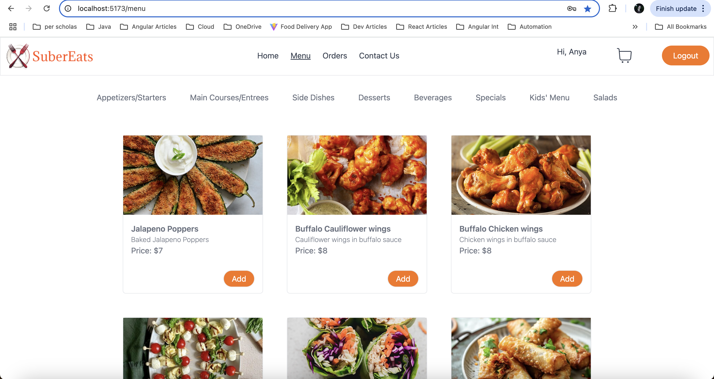

# Food Ordering App

## Overview

The MERN Food Ordering App is a full-stack web application designed to provide users with a seamless experience for ordering food . It incorporates modern technologies and best practices to offer features such as user signup, user login ,user authentication, cart management, live order tracking, and more.

## Technologies Used

- Database - MongoDB/Mongoose
- Backend - Expressjs, Nodejs
- Frontend - React/Zustand,Tailwind CSS ,Toastify for success messages.
- Render for deployment,Git for version control

## Prerequisites

- MongoDB
- Node
- npm

## Link To Live Site

Render Frontend Link - https://food-delivery-app-8yi1.onrender.com/menu
Render Backend Link - https://food-delivery-app-backend-74uc.onrender.com

## Key Features

1. User Authentication and Registration: Users can sign up for an account, log in, and manage their profiles (User and Admin). This ensures a personalized experience and allows users to track their order history.
2. Filtering of menu according to category of food.
3. Displaying of all the menu items according to category .
4. Cart Management- Adding food item to cart, incrementing ,decrementing quantity as well as removing item from cart.
5. Used Toastify for success messages.
6. Used Multer to upload images.
7. Admin route is protected only user with admin role can go to admin routes, noraml user is redirected to home page if the navigate to that url.
8. User react-router-dom for navigation.
9. Used Zustand ,useState,useEffect,UseNavigation and useLocation.

## Usage instructions, if relevant.

### Admin Panel

